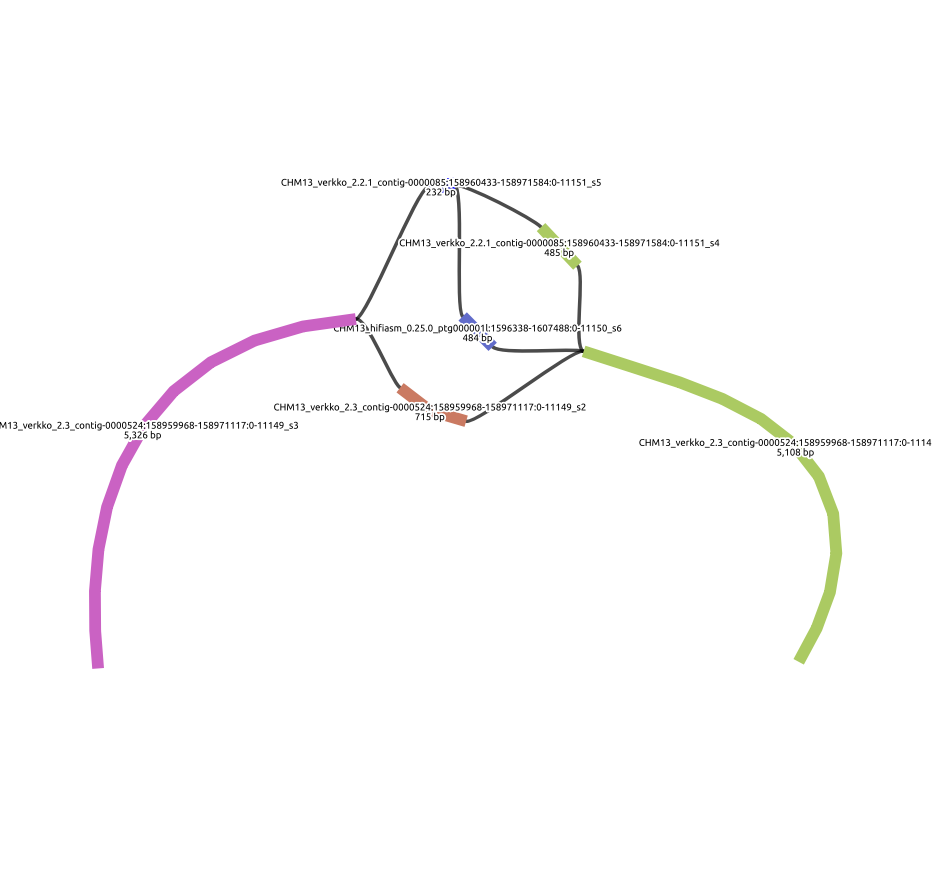

# Snakemake-asm-evaluation-vg
Assessing assemblies with variation graphs.
> WIP



## Workflow
1. Perform AvA alignment of assemblies with [`minimap2`](https://github.com/lh3/minimap2).
    * Each assembly and its sequences should have a shared prefix delimited by an underscore. (ex. `CHM13_*`) 
2. Query each region in provided bedfile with [`impg`](https://github.com/pangenome/impg).
3. Generate variation graph of queried regions with [`minigraph`](https://github.com/lh3/minigraph).
4. Rename segments in rGFA to SN tag.
5. Call variants with [`gfatools`](https://github.com/lh3/gfatools).
5. Visualize with [`Bandage`](https://github.com/rrwick/Bandage).

## Usage
```bash
snakemake -np --configfile config.yaml 
```

## Test
On a simple repeat region flagged by NucFlag v1.0 from three CHM13 assemblies (`hifiasm v0.25.0`, `Verkko 2.2.1`, and `Verkko 2.3`).
* See `test/input/misassemblies.bed`

```bash
snakemake -np --configfile test/config/config.yaml
```

## TODO
* [ ] - Inject annotations into graph as *segments* not paths. Tried odgi inject but expects numerical segments so not suited for our use-case.
* [ ] - Intersect graph SVs with provided annotations.
